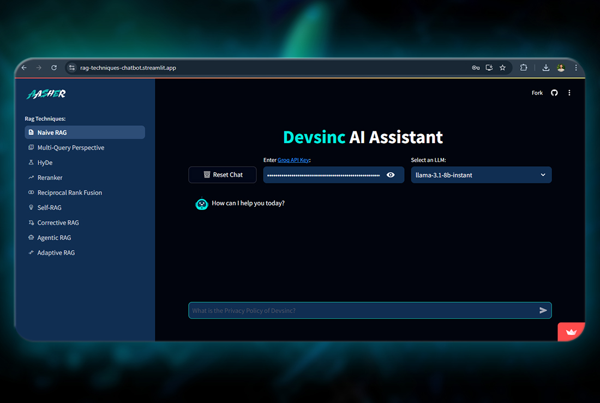

# RAG Chatbot

This Streamlit application demonstrates various Retrieval-Augmented Generation (RAG) techniques using the Devsinc AI Assistant.
It provides an interactive interface to explore different RAG methods and their applications in question-answering tasks.



## ⚡Features

- Interactive chat interface with AI assistant
- Multiple RAG techniques and types implemented:
  - Naive RAG
  - Multi-Query Perspective
  - Hypothetical Document Embeddings (HyDE)
  - Reranker
  - Reciprocal Rank Fusion
  - Self-RAG
  - Corrective RAG
  - Agentic RAG
  - Adaptive RAG
- LLM selection option
- Vector store integration using FAISS

## Getting Started

1. **Clone the repository:**
   ```
   git clone https://github.com/aasherkamal216/Devsinc-RAG-Chatbot.git
   cd Devsinc-RAG-Chatbot
   ```
2. **Set Up a Virtual Environment:**
```
python -m venv venv
venv\Scripts\activate
```
3. **Install the required dependencies:**
   ```
   pip install -r requirements.txt
   ```
4. **Get your API key:**
   - [Groq API key](https://console.groq.com/keys)
   - [Cohere API key](https://dashboard.cohere.com/api-keys)
   
5. **Set up environment variables:**
   Create a `.env` file in the root directory and add the following:
   ```
   COHERE_API_KEY=your_cohere_api_key
   GROQ_API_KEY=your_groq_api_key
   ```

6. **Running the App**

Run the Streamlit app:
```
streamlit run app.py
```
Your app should now be running at `http://localhost:8501`

